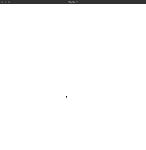

# Flowpaint
A functional reactive live painting software. Inspiration taken from https://github.com/madjestic/Haskell-OpenGL-Tutorial/tree/master/MandelbrotYampa.

For now, it is:

## How to run
- `git clone` the directory
- run with `cabal run`

## Things to do
- Finalise the implementation of the watercolour diffusion algorithm 👍
- Figure out how to use `yampa` as the primary means of interaction with the mouse-events and the eventual watercolour diffusion. 👍
    - This may result in a change in front-end, as GLUT uses its own event-loop. I am convinced that using wrappers to openGL is better than writing a new JS front-end though (after exploring the JS front end that already exists (blank-canvas), I am not convinced I have sufficient time to learn how to code a JS wrapper in Haskell with the time left). 👍
- Performance evaluations by using some benchmarking tool in Haskell 👍
- Write the dissertation. 👍
